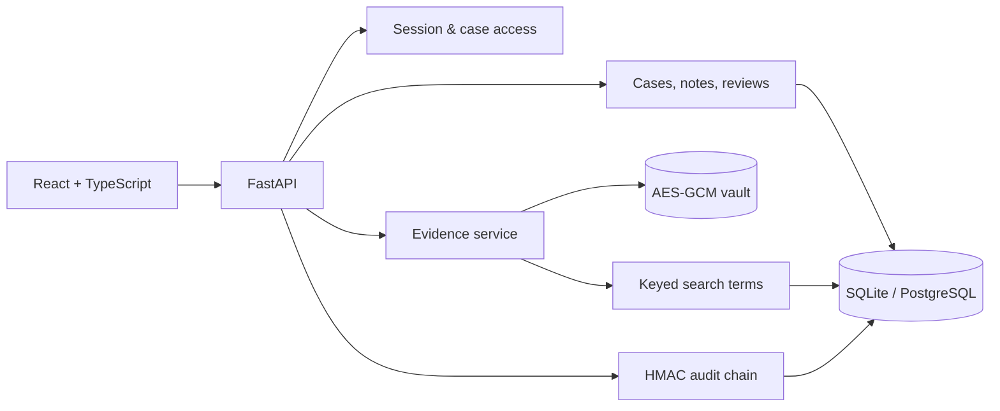

# CaseVault

**Secure digital document management for legal and investigation case files**
Smart India Hackathon problem statement **26190** · Ministry of Home Affairs / NCRB Women Safety Division

CaseVault is a working, local-first case document system. Its running API is the `app.dms` domain in this repository; the earlier ID-SHIELD identity-forensics code remains in the tree for reference but is not registered in the application.

> The supplied statement describes a legal and investigation DMS throughout. Its final “police assets throughout their lifecycle” line conflicts with the title and description. This implementation follows the DMS scope.

## What works

| Capability | Implementation |
|---|---|
| Case files | Unique case references, categories, classifications, status, lead, retention date, legal hold |
| Controlled access | Administrator, investigator, legal, auditor roles; explicit viewer/editor case membership; every case and evidence route checks access |
| Authentication | One-time token protected setup, PBKDF2 password hashes, 12-hour bearer sessions, lockout after failed attempts, password rotation and session revocation |
| Evidence | PDF, DOCX, TXT, PNG, JPEG upload with signature/size checks; AES-256-GCM encryption before disk storage |
| Versioning | New uploads create immutable versions; originals remain available; SHA-256 and authenticated decryption verified before retrieval |
| Search | Case metadata and document titles/filenames; extracted text indexed by keyed search tokens, while extracted text itself is encrypted |
| Extraction | Text from PDF/DOCX/TXT; image OCR when Tesseract is installed. An unavailable extraction is surfaced honestly |
| Audit | Actor, case, action, target, time and HMAC-linked event hashes; chain verification, case activity, CSV export |
| Collaboration | Case notes, explicit access grants, assigned human reviews with recorded decisions |
| Demo | One-click synthetic cases with actual encrypted PDF files; every sample is fictional |
| UI | Responsive layout, light and dark themes, subtle transitions, keyboard focus states and reduced-motion support |

The API never claims that a hash is a legal digital signature. Blockchain anchoring, qualified signatures, external government integrations, malware scanning and jurisdiction-specific compliance certification are **not** implemented. See [security and production scope](docs/casevault-security.md).

## Run locally

Prerequisites: Python 3.11+, Node 20+, npm. Tesseract is optional for image OCR.

```powershell
python -m venv .venv
.\.venv\Scripts\python.exe -m pip install -r backend\requirements.txt
cd frontend
npm ci
npm run build
cd ..\backend
..\.venv\Scripts\python.exe -m uvicorn app.main:app --host 127.0.0.1 --port 8000
```

Open [http://localhost:8000](http://localhost:8000). The FastAPI server serves the built React app and API on one origin. For development hot reload, run `npm run dev` in `frontend` alongside the backend; Vite proxies `/api` to port 8000.

### First administrator

The first page asks for a setup token. By default, CaseVault creates random token bytes in `backend/data/casevault.setup-token`. From the repository root, display the hex value:

```powershell
.\.venv\Scripts\python.exe -c "from pathlib import Path; print(Path('backend/data/casevault.setup-token').read_bytes().hex())"
```

Alternatively set `DMS_SETUP_TOKEN` in the environment before starting the server. Create your administrator account, then use **Load sample cases** on the empty dashboard if you want fictional data for a demo. Change any shared demonstration password before exposing an installation to others.

### Docker

```bash
docker compose up --build
```

Open [http://localhost:8000](http://localhost:8000). Compose persists the database, vault files and generated encryption key in the `casevault-data` volume. If `DMS_SETUP_TOKEN` is not configured, retrieve the generated token with:

```bash
docker compose exec app python -c "from pathlib import Path; print(Path('/app/data/casevault.setup-token').read_bytes().hex())"
```

Back up the **database, vault directory and encryption key together**. Losing the key makes stored evidence unreadable. Set `DMS_MASTER_KEY` to a securely managed 64-character hex value for a managed deployment. The startup key fingerprint check stops the app if a different key is supplied for an existing database.

## Architecture



The running backend is split into `backend/app/dms/{models,security,access,evidence,audit,routes,demo,installation}.py`. The frontend is under `frontend/src/dms/`. SQLite is the local default; SQLAlchemy models and the included `psycopg` driver support PostgreSQL via `DATABASE_URL=postgresql+psycopg://...`. For production, use migrations, managed secrets, encrypted database backups, TLS, monitoring and a persistent store.

Detailed notes: [architecture](docs/casevault-architecture.md) · [API](docs/casevault-api.md) · [security](docs/casevault-security.md).

## Verify

```powershell
cd backend
..\.venv\Scripts\python.exe -m pytest tests/test_dms.py -q
cd ..\frontend
npm run build
```

The API test exercises unauthorized access, case membership, encrypted evidence, searchable text, preserved versions, legal hold, reviews, password rotation and detection of file/audit tampering. Older ID-SHIELD tests target the dormant identity prototype and are not part of the CaseVault test suite.

## 🚀 Live Demo & Deployment

- **Live URL:** [https://YOUR-RENDER-URL.onrender.com](https://YOUR-RENDER-URL.onrender.com)
- **API Documentation:** [https://YOUR-RENDER-URL.onrender.com/docs](https://YOUR-RENDER-URL.onrender.com/docs)
- **Deployment Platform:** Render (FastAPI Web Service)
- **Status:** Active & Deployed

> **Note for Evaluators:**  
> First-time setup uses the pre-configured admin token: `myadmin1234567890abcdef`.
